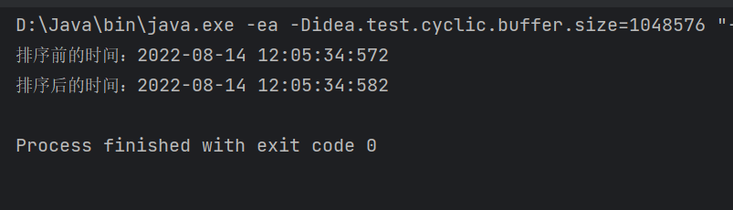

# 堆排序

堆排序是利用堆这种数据结构而设计的一种算法，堆排序是一种选择排序，时间复杂度为O(nlogn)，是不稳定排序

堆是具有以下性质的完全二叉树：每个节点的值都大于或等于其左右子节点的值，称为大顶堆，每个节点的值都小于等于其左右节点的值称为小顶堆

大顶堆特点：arr[n]>=arr[2*n+1]&&arr[n]>=arr[2*n+2]

小顶堆特点：arr[n]<=arr[2*n+1]&&arr[n]<=arr[2*n+2]

一般升序用大顶堆，降序用小顶堆

##堆排序的思想

1. 将待排序的序列构造成一个大顶堆
2. 此时，整个序列的最大值就是堆顶的根节点
3. 将其与末尾元素进行交换，此时末尾就是最大元素
4. 然后再将前n-1个数的序列构造成一个大顶锥，重复上述操作
5. 最终得到一个有序的数组

## 构造顶堆

先找到数组对应树的最后一个非叶子节点的下标，公式为n=arr.length/2-1，从右至左，从下至上进行调整

让该节点与右子节点和左子节点进行比较，找到最大的那个节点，与该节点进行值交换

再找到上一个非叶子节点，重复上一步骤，在调整之后，更改的子节点如果是非叶子节点，则需重新比较

```java
public static void sort(int[] arr){
    int temp=0;
    //将待排序的序列构造成一个大顶堆
    for (int i = arr.length/2-1; i >=0; i--) {
        adjust(arr,i, arr.length);
    }
    //将其与末尾元素进行交换，此时末尾就是最大元素
    for (int i = arr.length-1; i >0; i--) {
        temp=arr[i];
        arr[i]=arr[0];
        arr[0]=temp;
        adjust(arr,0, i);//因为以下的节点已经是大顶堆了，所以只需要从0开始调整
    }
}

/**
 * 将以i为根节点的树调整成大顶堆
 * @param arr:要调整的数组
 * @param i:非叶子节点的索引
 * @param length:数组中要调整序列的长度
 */
public static void adjust(int arr[],int i,int length){
    int temp=arr[i];
    //j是i的左子节点,循环结束后j变成你呢j的左子节点
    for (int j = 2*i+1; j <length; j=2*j+1) {
        if(j+1<length&&arr[j]<arr[j+1]){//找到左子节点和右子节点中最大的那一个
            j++;
        }
        if(arr[j]>temp){//跟中间节点比较如果下面更大就换上去
            arr[i]=arr[j];
            i=j;
        }else{
            break;
        }
    }
    //for循环结束后，以i为根节点的数已经是一个大顶堆了
    arr[i]=temp;//i此时指向最底端被换掉的一个节点，所以将temp移到这来
}
```

效率测试

结果用时：10ms



