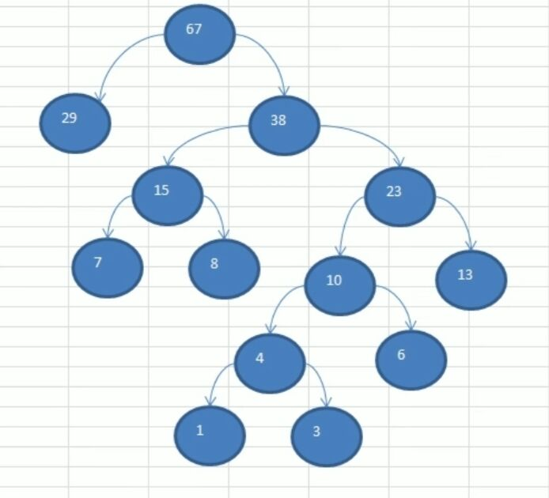

# 赫夫曼树

给定n个权值作为n个叶子结点，构造一棵二叉树，若该树的带权路径长度达到最小，称这样的二叉树为最优二叉树，也称为哈夫曼树

赫夫曼树是带权路径长度最短的树，权值较大的节点离根较近

## 构建赫夫曼树

1. 从小到大进行排序，将每个数据都看成是一个节点，每个节点都看成是一棵最简单的二叉树
2. 取出根节点权值最小的两棵二叉树
3. 组成一个新二叉树，该新二叉树的根节点的权值是前两棵二叉树根节点权值的和
4. 再将这棵新的二叉树以根节点权值大小再次排序，不断重复1234的步骤，直到数列中所有数据都被处理，就得到一棵赫夫曼树



```java
//节点类
class Node implements Comparable<Node>{
    int value;
    Node left;
    Node right;

    public Node(int value) {
        this.value = value;
    }

    @Override
    public String toString() {
        return "Node{" +
                "value=" + value +
                '}';
    }

    @Override
    public int compareTo(Node o) {
        return this.value-o.value;
    }

    //前序遍历
    public void preOrder(){
        System.out.println(this.value);
        if(this.left!=null){
            this.left.preOrder();
        }
        if(this.right!=null){
            this.right.preOrder();
        }
    }
}
```

```java
//创建赫夫曼树
public static Node createHuffumanTree(int[] arr){
    //遍历arr数组，将arr的每个元素构成一个node，再将node放入ArrayList中
    ArrayList<Node> nodes = new ArrayList<>();
    for (int i = 0; i < arr.length; i++) {
        nodes.add(new Node(arr[i]));
    }
    while(nodes.size()!=1){
        //排序从小到大
        Collections.sort(nodes);
        //取出根节点权值最小的二叉树
        Node left=nodes.get(0);
        //取出根节点权值第二小的二叉树
        Node right = nodes.get(1);
        //构建一棵新的二叉树
        Node parent=new Node(left.value+ right.value);
        parent.left=left;
        parent.right=right;
        //从ArrayList中删除left和right
        nodes.remove(left);
        nodes.remove(right);
        //将parent加入
        nodes.add(parent);
    }
    return nodes.get(0);
}
```

## 赫夫曼编码

原理

1. 先统计文件中个字符对应的个数
2. 按照上面各字符出现次数构建一棵赫夫曼树，次数作为权值
3. 根据赫夫曼树，给各个字符规定编码，向左路径为0，向右路径为1


###编码过程

```java
//获取每个字符出现的次数
private static List<Node2> getNodes(byte[] bytes){
    //创建一个ArrayList
    ArrayList<Node2> node2s = new ArrayList<>();
    //用map来存储每个字符出现的次数
    HashMap<Byte, Integer> byteIntegerHashMap = new HashMap<>();
    for (byte b:bytes) {
        Integer integer=byteIntegerHashMap.get(b);
        if(integer==null){
            byteIntegerHashMap.put(b,1);
        }else{
            byteIntegerHashMap.put(b,integer+1);
        }
    }
    for (Map.Entry<Byte, Integer> entry:byteIntegerHashMap.entrySet()){
        node2s.add(new Node2(entry.getKey(),entry.getValue()));
    }
    return node2s;
}
```

```java
//通过ArrayList创建赫夫曼树
private static Node2 create(List<Node2> node2s){
    while (node2s.size()>1){
        Collections.sort(node2s);
        Node2 node1 = node2s.get(0);
        Node2 node2 = node2s.get(1);
        Node2 parent = new Node2(null, node1.weight + node2.weight);
        parent.left=node1;
        parent.right=node2;
        node2s.remove(node1);
        node2s.remove(node2);
        node2s.add(parent);
    }
    return node2s.get(0);
}
```

```java
/**
 * 将赫夫曼编码表存放在map中
 * @param tree:传入节点
 * @param code:用于表明路径是从左来还是从右来,左0右1
 * @param stringBuilder:用于拼接路径
 * @return :赫夫曼编码表
 */
static HashMap<Byte, String> huffumanMap = new HashMap<>();
static StringBuilder stringBuilder=new StringBuilder();
static int last;//用于记录最后一个数的位数
public static void getCodeList(Node2 tree,String code,StringBuilder stringBuilder){
    StringBuilder stringBuilder1 = new StringBuilder(stringBuilder);
    stringBuilder1.append(code);
    if(tree!=null){
        if(tree.data==null){
            //还未到叶子结点，递归向左
            getCodeList(tree.left,"0",stringBuilder1);
            //左递归完回来，向右递归
            getCodeList(tree.right,"1",stringBuilder1);
        }else{
            //表示已经是叶子结点
            huffumanMap.put(tree.data, String.valueOf(stringBuilder1));
        }
    }
}
public static Map<Byte,String> getCodeList(Node2 root){
    if(root==null){
        return null;
    }
    //处理root左子树
    getCodeList(root.left,"0",stringBuilder);
    //处理root右子树
    getCodeList(root.right,"1",stringBuilder);
    return huffumanMap;
}
```

```java
/**
 * 将一个字符数组压缩为赫夫曼编码数组
 * @param bytes:原始字符串
 * @param huffmanCode:赫夫曼编码表
 * @return :赫夫曼编码处理后的数组
 */
private static byte[] zip(byte[] bytes,Map<Byte,String> huffmanCode){
    //1. 利用Huffman编码表将bytes转换成赫夫曼编码对应的字符串
    StringBuilder stringBuilder1 = new StringBuilder();
    for (byte b:bytes) {
        stringBuilder1.append(huffmanCode.get(b));
    }
    int len;
    if(stringBuilder1.length()%8==0){
        len=stringBuilder1.length()/8;
    }else{
        len=stringBuilder1.length()/8+1;
    }
  	last=stringBuilder1.length()%8;
    byte[] by = new byte[len];
    int index = 0;//记录是第几个byte
    for (int i = 0; i < stringBuilder1.length(); i+=8) {
        String stringByte;
        if(i+8>stringBuilder1.length()){
            stringByte=stringBuilder1.substring(i);
        }else{
            stringByte=stringBuilder1.substring(i,i+8);
        }
        by[index++]=(byte) Integer.parseInt(stringByte,2);
    }
    return by;
}
```

```java
/**
 * 以上方法的封装，直接输入原始byte数组，得到赫夫曼编码数组
 * @param bytes 原始数组
 * @return 赫夫曼编码数组
 */
private static byte[] huffmanZip(byte[] bytes){
    //获取各个字符出现次数的节点
    List<Node2> nodes = getNodes(bytes);
    //将出现次数作为权重，创建赫夫曼树
    Node2 huffuman = create(nodes);
    //根据赫夫曼树，得到赫夫曼编码表
    huffumanMap = (HashMap<Byte, String>) getCodeList(huffuman);
    //根据赫夫曼编码表编码原先的bytes数组
    byte[] zip = zip(bytes, huffumanMap);
    return zip;
}
```

### 解码过程

```java
/**
 * 将一个赫夫曼编码转换为一个赫夫曼二进制编码字符串
 * @param b 赫夫曼编码
 * @param flag 标志是否需要补高位
 * @return 二进制编码字符串
 */
private static String byteToBitString(byte b,boolean flag){
    int temp=b;
        temp|=256;
        String s = Integer.toBinaryString(temp);
        if(flag){
            return s.substring(s.length()-8);//如果不是最后一个，那么每位都是八个字符
        }else{
            return s.substring(s.length()-last);//如果是最后一个，那么就按照最后一个数的位数进行截断，同时把负数情况也考虑进去了
        }
}

private static byte[] decode(Map<Byte,String> huffmanCode,byte[] huffmanByte){
    //1. 先得到huffmanByte对应的二进制字符串
    StringBuilder stringBuilder1=new StringBuilder();
    for (int i = 0; i < huffmanByte.length; i++) {
        boolean flag=(i==huffmanByte.length-1);
        stringBuilder1.append(byteToBitString(huffmanByte[i],!flag));
    }
    System.out.println(stringBuilder1);
    //把字符串按照指定的赫夫曼编码表来解码
    //翻转赫夫曼编码表
    HashMap<String, Byte> stringByteHashMap = new HashMap<>();
    for(Map.Entry<Byte,String> entry: huffmanCode.entrySet()){
        stringByteHashMap.put(entry.getValue(),entry.getKey());
    }
    ArrayList<Byte> list = new ArrayList<>();
    for(int i=0;i<stringBuilder1.length();i++){
        int count=1;
        boolean flag=true;
        Byte b=null;
        while(flag){
            String key=stringBuilder1.substring(i,i+count);//i不动，让count走，直到匹配到一个字符
            b=stringByteHashMap.get(key);
            if(b==null){
                //没匹配到
                count++;
            }else{
                //匹配到,退出
                flag=false;
            }
        }
        list.add(b);
        i+=count-1;
    }
    //for循环结束后，list中就存储了所有的字符
    byte[] bytes = new byte[list.size()];
    for (int i = 0; i < bytes.length; i++) {
        bytes[i]=list.get(i);
    }
    return bytes;
}
```

### 文件压缩

```java
/**
 * 压缩文件
 * @param srcFile 传入文件的路径
 * @param destFile 压缩后文件的路径
 */
public static void zipFile(String srcFile,String destFile) {
    FileInputStream fileInputStream = null;
    byte[] b;
    try {
        //创建输入流
        fileInputStream = new FileInputStream(srcFile);
        b = new byte[fileInputStream.available()];
        //读取文件
        fileInputStream.read(b);
    } catch (IOException e) {
        throw new RuntimeException(e);
    } finally {
        if (fileInputStream != null) {
            try {
                fileInputStream.close();
            } catch (IOException e) {
                throw new RuntimeException(e);
            }
        }
    }
    byte[] huffmanZip = huffmanZip(b);
    ObjectOutputStream objectOutputStream = null;
    try {
        //创建输出流，存放文件
        FileOutputStream fileOutputStream = new FileOutputStream(destFile);
        objectOutputStream = new ObjectOutputStream(fileOutputStream);
        //以对象流方式写入赫夫曼编码和赫夫曼编码表
        objectOutputStream.writeObject(huffmanZip);
        objectOutputStream.writeObject(huffumanMap);
        objectOutputStream.writeObject(last);
    } catch (IOException e) {
        throw new RuntimeException(e);
    } finally {
        if(objectOutputStream!=null){
            try {
                objectOutputStream.close();
            } catch (IOException e) {
                throw new RuntimeException(e);
            }
        }
    }
}
```

### 文件解压

```java
/**
 * 解压文件
 * @param zipFile 要解压的文件
 * @param destFile 解压的位置
 */
public static void unZipFile(String zipFile,String destFile){
    FileInputStream fileInputStream = null;
    ObjectInputStream objectInputStream = null;
    FileOutputStream fileOutputStream = null;
    try {
        fileInputStream = new FileInputStream(zipFile);
        objectInputStream = new ObjectInputStream(fileInputStream);
        fileOutputStream = new FileOutputStream(destFile);
        //对象流读取
        byte[] huffmanByte = (byte[]) objectInputStream.readObject();
        huffumanMap = (HashMap<Byte, String>) objectInputStream.readObject();
        last=(int)objectInputStream.readObject();
        byte[] decode = decode(huffumanMap, huffmanByte);
        fileOutputStream.write(decode);
    } catch (IOException e) {
        throw new RuntimeException(e);
    } catch (ClassNotFoundException e) {
        throw new RuntimeException(e);
    } finally {
        try {
            fileInputStream.close();
            fileOutputStream.close();
            objectInputStream.close();
        } catch (IOException e) {
            throw new RuntimeException(e);
        }
    }
}
```

